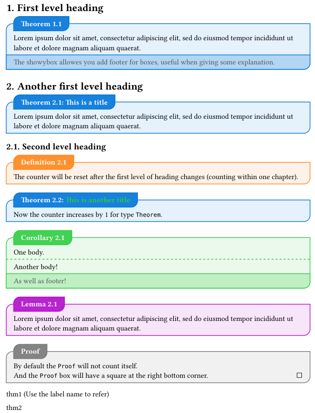

# typst-theorem-boxes

Theorem boxes in [typst](https://github.com/typst/typst), implemented by [showybox](https://github.com/Pablo-Gonzalez-Calderon/showybox-package), providing a beautiful way to display **theorems, definitions, lemmas, corollaries, and proofs**.

The boxes will be counted like `x.y`, where `x` is the **first level heading number** and `y` is the box number of the type.



## Usage
```typst
#import "/path/to/thms/lib.typ": *

#set heading(numbering: "1.")
#show: thmrules

#theorem(title: [A title], [One body.], footer: [As well as footer!])[Another body!]
```
- For more examples, see examples folder.
